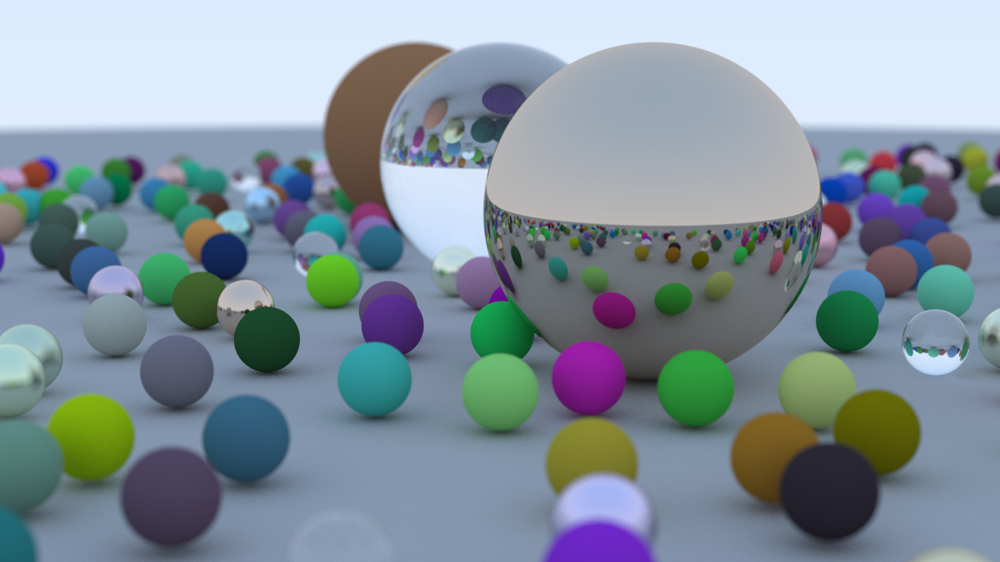

# Ray Tracing in One Weekend

A C++ implementation of Peter Shirley's [_Ray Tracing in One Weekend_](https://raytracing.github.io/books/RayTracingInOneWeekend.html).



## The scene

The render above is the book's final scene:

- A large gray ground sphere.
- Nearly 500 small spheres placed at random on a grid. Each gets a random material: 80% diffuse, 15% metal with random fuzz, 5% glass.
- Three large spheres in the middle: diffuse brown, glass, and polished metal.
- Camera at `(13, 2, 3)` looking at the origin, 20° vertical field of view, depth of field with a 0.6° defocus angle focused 10 units away.
- 1200x675 pixels, 500 samples per pixel, up to 50 bounces per ray.

## Features

- Vector math (`vec3.h`), rays (`ray.h`), and value ranges (`interval.h`).
- Sphere intersection with front/back face detection (`sphere.h`).
- Materials (`material.h`):
  - `lambertian` - diffuse surfaces.
  - `metal` - reflective surfaces with adjustable fuzz.
  - `dielectric` - glass with refraction, total internal reflection, and Schlick's reflectance approximation.
- Positionable camera with adjustable field of view and defocus blur (`camera.h`).
- Antialiasing through random samples per pixel, and gamma-corrected output (`color.h`).

## Build and run

Needs a C++17 compiler.

```sh
c++ -std=c++17 -O3 -o main main.cpp
./main > image.ppm
```

The program writes a plain-text PPM image to stdout and progress to stderr. To make a PNG:

```sh
ffmpeg -i image.ppm image.png
```
